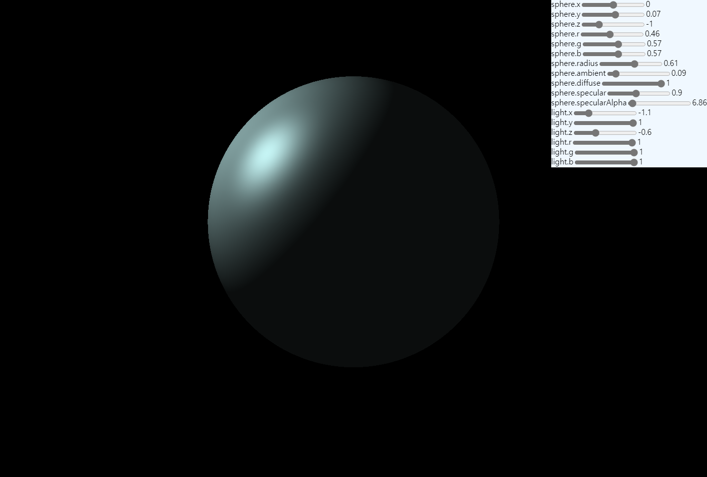
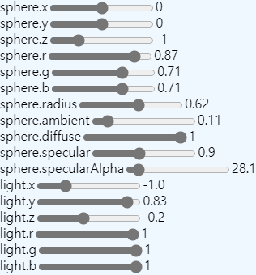
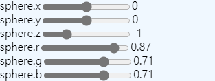
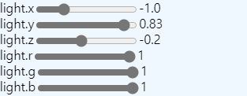
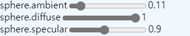
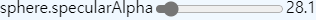

# Phong Reflection Model Simulator

[**Try here**](https://nagi0101.github.io/webgl_phong_reflection_model/)

Simple page rendering [phong reflection model](https://en.wikipedia.org/wiki/Phong_reflection_model)ed sphere. Browser supporting WebGL2 is required. 

## Parameter

- Position and color of sphere and light.  

- Radius of sphere.  

- Brightness of ambient, diffuse, and specular.  

- Shineness of sphere. Inverse proportion to size of it's highlight.  
